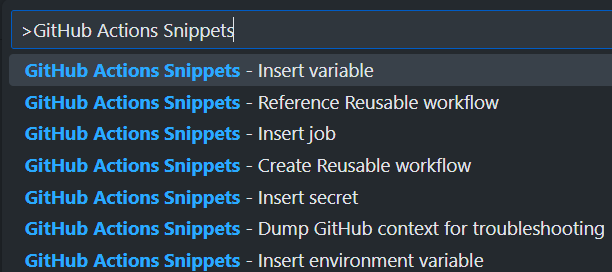

# VS Code Snippets for GitHub Actions

VS Code snippets for authoring GitHub Actions workflow files.

## ✅ Getting Started

1. Install the extension
1. Open the command palette (Ctrl+Shift+P), type "GitHub Actions Snippets", select a snippet, press enter.

## 💡 Features

Includes snippets to peform the following:

- Insert Secret
- Insert Environment Variable
- Insert Variable
- Insert Job
- Dump GitHub Context for troubleshooting
- Reference Reusable Workflow

## 📃 Docs

- VS Code Snippets: [https://code.visualstudio.com/docs/editor/userdefinedsnippets](https://code.visualstudio.com/docs/editor/userdefinedsnippets)

## 🚚 Release Notes

### 0.0.1

Initial release

---
